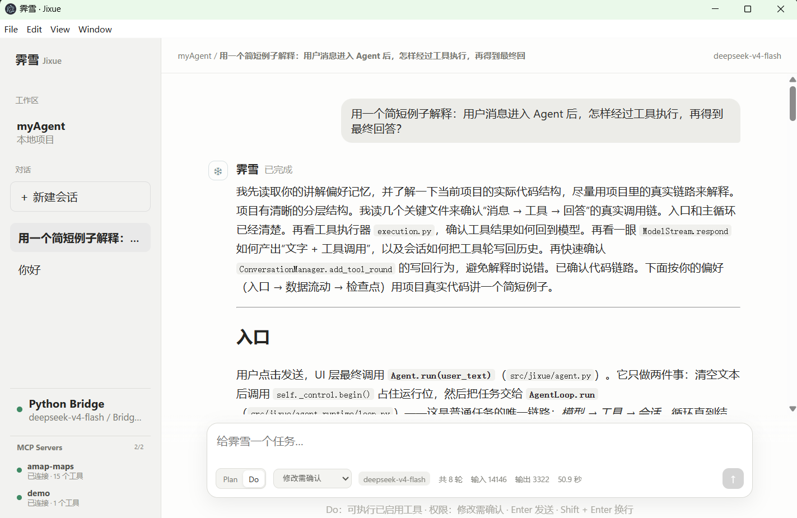
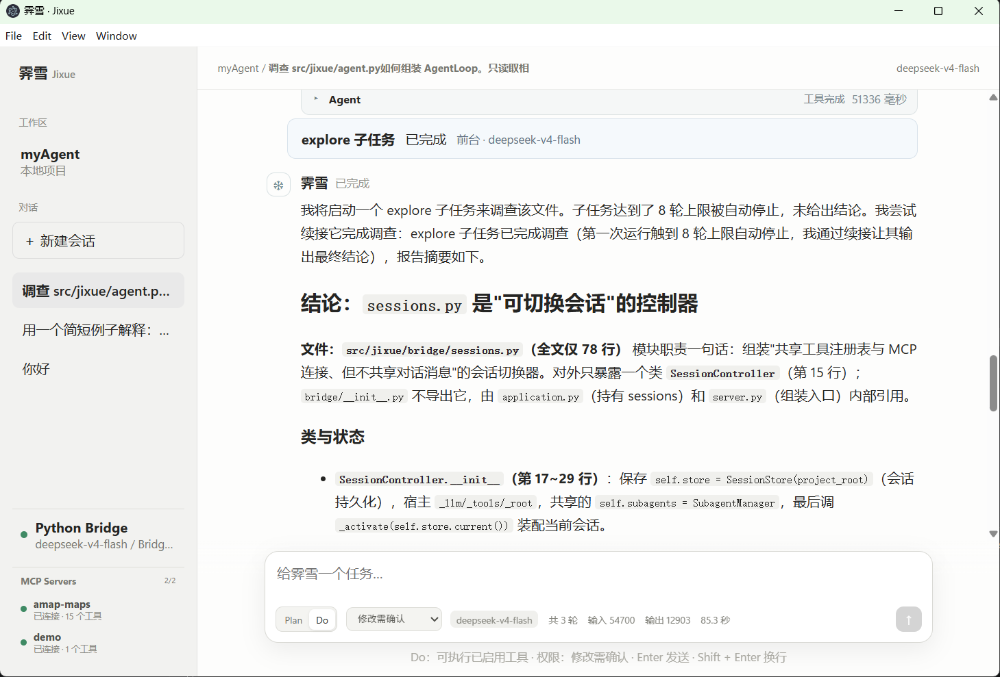
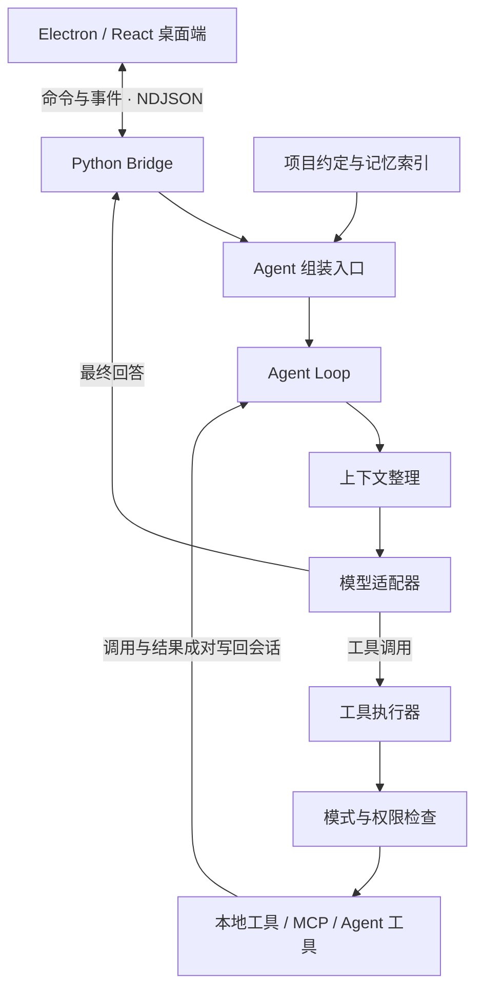

# 霁雪 · Jixue

**一个面向本地代码项目的轻量桌面 Agent，让模型从「回答问题」走到「调用工具、完成任务」。**

霁雪以简化版 Claude Code 为目标，逐步搭建工具循环、权限控制、上下文压缩、项目记忆、子 Agent 协作和渐进式技能加载。项目用 Python 实现 Agent 核心，用 Electron + React 展示执行过程，适合学习、阅读源码和继续扩展。

**Python 3.12+ · Electron · React · TypeScript · MCP**

[快速启动](#快速启动) · [核心设计](#核心设计) · [阅读源码](#阅读源码) · [章节文档](#章节文档)

## 界面演示

### 使用项目记忆，延续沟通习惯

会话侧栏、Markdown 回复、Plan / Do 切换、权限选择和 MCP 连接状态集中在同一个窗口。下面的示例展示了 Agent 读取讲解偏好后，结合项目源码解释执行链路。



### 委派子任务，查看执行结果

主 Agent 可以将调查交给子 Agent，桌面端展示独立任务卡片、状态和执行详情。下面的示例展示了 `explore` 子任务达到轮数上限后，通过续接完成调查，再由主 Agent 汇总。



## 能做什么

| 能力 | 当前实现 |
| --- | --- |
| 代码与文件操作 | 读取、写入、精确编辑、文件查找、内容搜索和 Shell 命令执行 |
| 连续任务执行 | 模型与工具多轮循环，安全的只读工具分批并发，支持取消与连续异常工具调用保护 |
| 模式与权限 | Plan 只读调查、Do 执行任务；支持修改需确认、每次询问和自动允许三种权限策略 |
| MCP 扩展 | 接入 stdio / Streamable HTTP 服务，发现工具后纳入统一调用链，展示连接状态并后台重连 |
| 长对话管理 | 大结果落盘、旧工具正文清理、对话摘要；支持 `/compact` 和自动压缩 |
| 会话与记忆 | 保存、恢复和切换会话；加载项目约定，按需读取和维护四类项目记忆 |
| 子 Agent | 定义式与 Fork 两种创建方式，支持前台等待、后台只读、状态查询、停止和存档续接 |
| Skill 技能 | 发现项目技能简介，按需加载说明和参考资料、执行脚本；提供源码讲解与 Python AST 概览两个示例 |
| 执行可见性 | 流式文字、可折叠工具卡片、独立权限确认、累计 Token 和耗时展示 |

## 核心设计

### 一条消息如何跑到底

桌面端负责交互，Python 负责决策与执行。两端通过逐行 JSON（NDJSON）传递命令与事件；外部模型和 MCP SDK 封装在适配层中。



`agent.py` 显式组装 `RunControl`、`ModelStream`、`ToolExecutor`、`ContextCompactor` 和 `AgentLoop`。一次任务遵循同一条路径：**接收消息 → 请求模型 → 校验并执行工具 → 写回结果 → 继续请求模型 → 返回最终回答**。

### 三层上下文保护

模型只使用一份工作消息序列，按条件逐层缩减上下文：

| 层次 | 处理方式 | 保留什么 |
| --- | --- | --- |
| 大结果落盘 | 单次工具结果过大时，将全文保存到 `.jixue/tool-results/` | 预览和结果编号；通过 `read_artifact` 分段取回 |
| 旧工具正文清理 | 工具结果累计过大时，清理较早工具轮的正文 | 调用与结果的配对结构，以及最近的工具轮 |
| 对话摘要 | 手动 `/compact` 或达到自动触发线时，摘要较早的完整对话轮 | 摘要和最近 2 个完整对话轮 |

供应商报告上下文超长时，会尝试压缩并重试一次；自动摘要连续失败后暂停。当前预算使用字符数估算，尚未实现按模型窗口精确计算 Token 的预算管理。

### 两层项目记忆

**静态层**由用户维护根目录 `AGENTS.md`，记录项目说明和长期约定。**动态层**由主模型判断哪些信息值得保留，通过 `update_memory` 工具沿权限链写入，支持更新和忘记。

```text
.jixue/memory/
├── MEMORY.md                    # 索引：名称、类型、描述和正文入口
├── feedback_explanation.md      # 正文：讲解偏好
└── reference_api_docs.md         # 正文：接口文档的位置与查阅时机
```

动态记忆只允许 `user`、`feedback`、`project`、`reference` 四种类型。每条记忆是带 YAML 元信息的独立 Markdown 文件；`MEMORY.md` 由程序在记忆变更后更新，手动修改正文文件后可显式重建索引。

主 Agent 每次接收新任务时，重新读取项目约定和 `MEMORY.md`，组装 system prompt；模型根据索引调用 `read_memory` 按需读取正文，正文作为工具结果进入消息序列。同一任务的工具循环内，system prompt 保持稳定。

当前记忆范围是本项目，保存由主模型在任务中完成，尚未加入每轮结束后的后台自动提取和独立小模型检索。

### 一个工具，两种子 Agent

主模型通过统一的 `Agent` 工具创建和管理子任务，增加角色无需增加工具入口。

| | 定义式 | Fork 式 |
| --- | --- | --- |
| 创建方式 | 指定 `subagent_type` | 省略 `subagent_type` |
| 起始上下文 | 空白对话 + 固定角色 + 当前任务 | 父模型最近一次请求的上下文快照 + 当前任务 |
| 角色与模型 | Markdown + YAML 定义，可指定独立模型 | 继承父模型与请求前缀 |
| 适用任务 | 代码探索、审查等职责明确的工作 | 需要延续当前调查背景的工作 |

两种方式复用同一套 Agent Loop，但分别维护对话、权限等待、取消信号、压缩状态和用量；共享模型客户端、工具实现和 MCP 连接。子 Agent 不再委派子任务，后台任务限定为只读。父 Agent 接收报告或任务编号，子任务的内部工具轮留在自己的上下文中。

Fork 复制的是父请求实际使用的上下文，可能已经包含摘要。它保留请求前缀以创造缓存复用条件，实际命中由模型供应商决定。

## 快速启动

以下步骤面向 Windows / PowerShell。先安装 Conda 和 Node.js / npm，并确保终端可以找到它们。Python 后端固定使用名为 `mycoder` 的 Conda 环境。

### 1. 安装依赖

在项目根目录执行；已有 `mycoder` 环境时跳过创建命令，确认其中的 Python 为 3.12 或以上。

```powershell
conda create -n mycoder python=3.12 -y
conda run --no-capture-output -n mycoder python -m pip install -e ".[dev]"
npm install
```

### 2. 启动桌面端

```powershell
npm run dev
```

未配置 `.env` 时默认使用 `FakeLLM`，可离线检查桌面、Bridge 和预设工具交互。窗口左下角显示 Bridge 在线，表示前后端已连通；真实代码调查和自主任务需要配置模型。

### 3. 接入真实模型

参考根目录 [.env.example](.env.example)，创建本地 `.env` 并填入：

```dotenv
JIXUE_LLM_MODE=configured
JIXUE_MODEL_ID=flash
DEEPSEEK_API_KEY=你的Key
```

模型别名、模型 ID 和服务地址由 [config/models.yaml](config/models.yaml) 管理，当前配置使用 DeepSeek 的 Anthropic 兼容接口。保存后重启桌面端。MCP 接入配置见[第六章](docs/chapters/06-mcp/README.md)。

`.env` 和 `.jixue/` 均已被 Git 忽略，密钥、会话、记忆和工具大结果保存在本机。

### 4. 试一个完整任务

接入真实模型后，可以依次体验：

1. **调查代码**：选择 Plan，发送「读取 agent.py，解释它如何组装 Agent Loop，并给出文件依据。」观察工具卡片和最终回答。
2. **保存偏好**：切换 Do，发送「记住：讲解代码时先说入口，再说数据流，最后给一个例子。」按提示确认；新建会话后让它解释一个模块，观察记忆读取。
3. **委派任务**：发送「用 explore 子 Agent 调查上下文压缩的入口和触发条件，最后由你汇总。」观察子任务卡片与报告。

## 阅读源码

建议从组装入口读起，再沿任务循环进入各模块：

| 入口 | 重点 |
| --- | --- |
| [agent.py](src/jixue/agent.py) | Agent 由哪些组件组成 |
| [agent_runtime/loop.py](src/jixue/agent_runtime/loop.py) | 模型与工具如何循环到任务结束 |
| [agent_runtime/execution.py](src/jixue/agent_runtime/execution.py) | 权限、分批并发、异常保护与结果处理 |
| [agent_runtime/compaction.py](src/jixue/agent_runtime/compaction.py) | 手动与自动压缩如何共用执行流程 |
| [memory.py](src/jixue/memory.py) | 记忆正文与索引如何维护 |
| [skills.py](src/jixue/skills.py) | 技能简介如何发现、正文如何按需进入上下文 |
| [subagents/manager.py](src/jixue/subagents/manager.py) | 子任务如何创建、管理与续接 |
| [bridge/sessions.py](src/jixue/bridge/sessions.py) | 会话恢复、切换与 Agent 工具绑定 |

完整文件职责见[项目结构](docs/PROJECT_STRUCTURE.md)。

## 开发检查

类型检查、静态检查和桌面构建：

```powershell
conda run --no-capture-output -n mycoder ruff check src
conda run --no-capture-output -n mycoder mypy src
npm run typecheck
npm run build
```

自动化测试文件按项目约定只保留在本地开发机，并由 Git 忽略。拥有本地测试目录时，可运行以下命令；仅克隆仓库不会获得完整测试集。

```powershell
conda run --no-capture-output -n mycoder pytest
npm run test:frontend
npm run test:electron
```

## 章节文档

当前已完成第 0 至第 10 章。每章包含成果、核心文件、执行链路、启动测试和自测题，适合按顺序学习。

| 章节 | 内容 |
| --- | --- |
| [第 0 章](docs/chapters/00-foundation/README.md) | 工程准备与桌面骨架 |
| [第 1 章](docs/chapters/01-llm-ui/README.md) | 模型适配与流式聊天 |
| [第 2 章](docs/chapters/02-tools/README.md) | 工具注册与执行 |
| [第 3 章](docs/chapters/03-agent-loop/README.md) | Agent Loop、取消与并发 |
| [第 4 章](docs/chapters/04-system-prompt/README.md) | System Prompt 与动态提醒 |
| [第 5 章](docs/chapters/05-permissions/README.md) | 模式与权限控制 |
| [第 6 章](docs/chapters/06-mcp/README.md) | MCP 工具接入 |
| [第 7 章](docs/chapters/07-context/README.md) | 消息管理与三层上下文保护 |
| [第 8 章](docs/chapters/08-memory/README.md) | 会话持久化与项目记忆 |
| [第 9 章](docs/chapters/09-subagents/README.md) | 定义式与 Fork 子 Agent |
| [第 10 章](docs/chapters/10-skills/README.md) | 渐进式 Skill 加载与两个完整示例 |

后续规划见[开发路线](docs/ROADMAP.md)。
