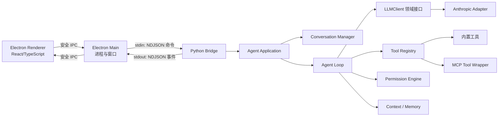

# 霁雪总体架构

## 1. 核心目标

霁雪不是“把 SDK 调通后不断加判断”的脚本，而是一个小型、可替换、可观察的 Agent Harness。首版只支持 Anthropic 协议适配器，但上层只认识霁雪自己的消息、事件、工具和配置类型。

最重要的四条边界：

1. Renderer 不接触 API Key，也不直接启动 Python。
2. Electron Main 只负责窗口、进程生命周期和安全 IPC，不理解 Agent 业务。
3. Python 领域层不导入 Electron、Anthropic 或 MCP SDK。
4. 所有长任务都输出事件流，UI 不同步等待最终结果。

## 2. 进程与数据流



选择 NDJSON 标准输入输出桥接，而不是第一周引入本地 HTTP 服务，原因是依赖更少、流式事件天然适配、端口管理更简单。Python 的标准输出只能写协议事件，普通日志一律写标准错误。

## 3. 当前目录

目录按能力增长，不提前创建未来章节的空包。下面只展示当前已存在的主要边界：

```text
myAgent/
├─ apps/
│  └─ desktop/                 # Electron 客户端
│     └─ src/
│        ├─ main/              # 窗口、Python 子进程、IPC
│        ├─ preload/           # contextBridge 白名单
│        ├─ renderer/          # 对话 UI
│        └─ shared/            # Main、Preload、Renderer 共用协议
├─ src/jixue/
│  ├─ domain/                  # 消息与事件等纯领域类型
│  ├─ llm/                     # LLM 接口与 FakeLLM
│  └─ bridge/                  # Electron 与 Python 的 NDJSON 协议
├─ tests/                      # 本地自动化测试，不加入 Git
├─ docs/                       # 设计、教学、日志、手测记录
├─ config/                     # 可提交的示例配置，不含密钥
├─ scripts/                    # 本地开发命令入口
├─ pyproject.toml
└─ README.md
```

每个现有目录和文件的逐项说明见 [目录与文件职责](PROJECT_STRUCTURE.md)。未来的 `conversation/`、`tools/`、`agent/` 等目录只在对应章节开始时创建，并在该文档中同步登记。

## 4. LLM 边界

### 4.1 四字段配置

单个 `LLMConfig` 严格只有：

```yaml
protocol: anthropic
model: deepseek-v4-flash
base_url: https://api.deepseek.com/anthropic
api_key: ${DEEPSEEK_API_KEY}
```

模型选择器是应用层的“模型目录”，目录中的每个条目仍然生成一个四字段配置。上下文窗口、展示名称、是否实验模型属于模型目录元数据，不进入 `LLMConfig`。首版 `config/models.yaml` 的完整形状如下：

```yaml
schema_version: 1
default_model: flash
models:
  flash:
    label: Flash
    experimental: false
    capabilities: [text, tools]
    context_window: 1000000
    llm:
      protocol: anthropic
      model: deepseek-v4-flash
      base_url: https://api.deepseek.com/anthropic
      api_key: ${DEEPSEEK_API_KEY}
  pro:
    label: Pro
    experimental: false
    capabilities: [text, tools]
    context_window: 1000000
    llm:
      protocol: anthropic
      model: deepseek-v4-pro
      base_url: https://api.deepseek.com/anthropic
      api_key: ${DEEPSEEK_API_KEY}
  vision_exp:
    label: Vision Exp
    experimental: true
    capabilities: [text, vision, tools]
    context_window: 1000000
    llm:
      protocol: anthropic
      model: deepseek-v4-flash-vision-exp
      base_url: https://api.deepseek.com/anthropic
      api_key: ${DEEPSEEK_API_KEY}
```

`flash`、`pro`、`vision_exp` 是稳定目录 ID，UI 状态和 `default_model` 只引用它，不把可变 label 或 API model 当主键。`config/models.local.yaml` 使用相同顶层结构：同 ID 的模型条目整体替换，不做字段级深合并，因此本地条目必须完整；`default_model` 若出现则覆盖默认值，未出现则沿用默认目录。合并后统一做 Schema 校验。

环境变量展开分成两种结果：字段结构正确且变量存在时为 `ready`；字段结构正确但 Key 对应变量缺失时为非致命 `credentials_missing`，允许 UI 启动但禁止发送该模型请求；字段缺失、协议未知、默认 ID 不存在或类型错误属于致命目录错误。

以上规则已经由 `src/jixue/llm/config.py` 实现并可独立诊断。`src/jixue/llm/factory.py` 直接消费这里生成的 `LLMConfig`，不会重新读取 YAML；`src/jixue/bridge/bootstrap.py` 已把目录、工厂和 Bridge 启动入口接通。默认聊天仍使用 FakeLLM，只有显式 configured 模式才选择正式客户端。

首版模型目录：

| UI 名称 | API 模型名 | 首版用途 |
| --- | --- | --- |
| Flash | `deepseek-v4-flash` | 默认，日常对话和工具任务 |
| Pro | `deepseek-v4-pro` | 复杂任务 |
| Vision Exp | `deepseek-v4-flash-vision-exp` | 先允许选择；图片输入在后续版本开放 |

`protocol` 首版只接受 `anthropic`。遇到其他值要返回“尚未安装该协议适配器”的领域错误，不能悄悄走错协议。

### 4.2 自有接口

当前第一章代码中的领域接口只暴露：

```text
LLMClient.model_name -> str
LLMClient.stream(prompt: str) -> AsyncIterator[LLMStreamEvent]
```

这里的 `prompt: str` 是尚未引入 ConversationManager 前的最小接口。后续会把输入升级为霁雪自己的消息请求类型，但不会暴露供应商类型。

`anthropic.AsyncAnthropic`、SDK 消息参数、流对象和 SDK 异常只能出现在 `llm/adapters/anthropic_client.py` 中。SDK 文本与最终 Message 必须先转换成 `LLMStreamEvent`，SDK 异常必须先转换成 `LLMClientError`，才能离开适配器。

适配器使用顶层 `cache_control={"type": "ephemeral"}` 为未来稳定的多轮前缀准备 Prompt Cache。当前只有一条短用户文本，且领域 `Usage` 尚未保存缓存读写字段，因此不能把“参数已经传入”误写成“已经观察到缓存命中”。

### 4.3 Bridge 运行模式

模型选择发生在 Python Bridge 进程启动时，而不是 Renderer 中。启动装配会先复制 Python 进程环境，再读取“当前项目根目录/.env”并覆盖同名值。系统环境只作兜底，项目 `.env` 具有更高优先级。最终只使用两个领域语义明确的启动变量：

| 环境变量 | 允许值 | 默认值 | 职责 |
| --- | --- | --- | --- |
| `JIXUE_LLM_MODE` | `fake`、`configured` | `fake` | 决定使用离线 FakeLLM，还是加载模型目录。 |
| `JIXUE_MODEL_ID` | `flash`、`pro`、`vision_exp` | 目录的 `default_model` | configured 模式下选择稳定目录 ID。 |

启动链路固定为：

```text
Electron Main 把 Python 工作目录固定为项目根目录
  → Python Bridge server.main()
  → bootstrap.create_runtime_llm(Path.cwd())
  → load_project_environment()
       先复制 os.environ
       再读取“项目根目录/.env”并覆盖同名值
  → fake: FakeLLMClient
  → configured: models.yaml → ModelCatalog → create_llm_client()
  → BridgeApplication
  → bridge.ready 携带实际 model_name
  → Electron 状态显示“实际模型 / Bridge 在线”
```

`.env` 不是 `.env.example`：前者是本地真实配置并被 Git 忽略，后者只是可提交模板。没有 `.env` 且系统环境也没设置模式时永远走 fake；单独存在 Key 也不会改变模式。configured 模式缺 Key 时仍能完成握手，第一次发送消息才返回 `credentials_missing`。非法模式、模型 ID 或目录结构属于启动装配错误，只写 stderr，不污染 stdout 的 NDJSON。

## 5. 消息模型

消息分两层：

- API 层：`role + content`，只含供应商能够接受的干净内容块。
- 内部层：增加 `id`、`status`、`created_at`、`usage`、`metadata`。

`ConversationManager.to_api_format()` 按固定顺序处理：

1. 过滤草稿、取消、仅 UI 可见和无有效内容的消息。
2. 把内部内容块转换为协议无关的 API 内容块。
3. 合并相邻同角色消息。
4. 校验 user/assistant 交替关系。
5. 第二章起校验 `tool_use` 与 `tool_result` 的引用关系。
6. 返回新对象，绝不原地修改内部历史。

## 6. 桥接事件协议

每条命令或事件占一行 JSON：

```json
{
  "version": 1,
  "type": "stream_text",
  "request_id": "req_xxx",
  "sequence": 12,
  "timestamp": "2026-08-30T12:00:00Z",
  "payload": {}
}
```

`request_id + sequence` 用于隔离并排序并发请求；未知事件由 UI 忽略并记警告，避免协议升级导致整个客户端崩溃。命令与事件按所属章节逐步增加。

| 方向 | 类型 | 所属章节 | 必要 payload |
| --- | --- | --- | --- |
| Main → Python | `bridge.hello` | 第 0 步 | 协议版本、客户端版本 |
| Python → Main | `bridge.ready` | 第 0 步 | 协议版本、后端版本、能力列表 |
| Main → Python | `chat.send` | 第 1 章 | 会话 ID、文本、模型 ID |
| Main → Python | `chat.cancel` | 第 3 章 | 目标 request_id |
| Main → Python | `mode.set` | 第 3 章 | `plan` 或 `do` |
| Main → Python | `permission.respond` | 第 5 章 | 权限请求 ID、允许或拒绝 |
| Main → Python | `session.load` | 第 8 章 | 会话 ID |
| Python → Main | `error` | 第 0 步 | 错误码、可公开消息、是否可重试 |

命令也使用相同 envelope，但 `sequence` 由发送端对同一 request_id 单调递增。完成或取消必须有终态事件确认；Electron Main 在收到 `bridge.ready` 前不转发业务命令。stdin 只由一个写队列串行写入；单行首版限制 1 MiB，超限返回协议错误。EOF、Python 非零退出或连续畸形行会使 Bridge 进入 unavailable，Main 终止当前请求并允许用户手动重启后端；首版不自动无限重启。Renderer 消费速度不足时，Main 对状态类事件只保留最新值，但不丢文本、工具、权限和终态事件。

业务事件按章节扩展，payload 的最小契约固定如下：

| 事件 | 首次实现 | 必要 payload |
| --- | --- | --- |
| `stream_text` | 第 1 章 | `text`、`message_id` |
| `usage` | 第 1 章 | 当轮与累计 input/output token |
| `turn_complete` | 第 1 章 | `turn_index`、`stop_reason`、总耗时 |
| `error` | 第 0 步 | `code`、`message`、`retryable`、`scope` |
| `tool_use` | 第 2 章 | `id`、`name`、`input` |
| `tool_result` | 第 2 章 | `tool_use_id`、`is_error`、耗时、UI metadata |
| `loop_complete` | 第 3 章 | 总 turn 数、结束原因 |

第 1 章把 `turn_complete` 作为单次 LLM 调用终态；第 3 章引入循环后，每次调用仍发 `turn_complete`，整个任务只额外发一次 `loop_complete`。第 2、3 章是在同一个可辨识联合类型上增加事件，不重新定义已有 payload。

## 7. UI 原则

- 流式阶段只把文本增量追加到纯文本缓冲区，不对半截 Markdown 反复解析。
- 回复完成后再执行 Markdown 渲染，并做 HTML 清洗。
- 状态栏显示模型、当轮输入/输出 Token、累计 Token、首 Token 耗时和总耗时。
- 工具调用、权限确认、压缩和子 Agent 都用事件卡片展示，不把内部日志混进对话正文。
- Renderer 开启上下文隔离，不暴露 Node 全局对象；API Key 只存在 Python 进程环境中。

## 8. 首版明确不做

- 不做安装包、自动更新和应用商店发布。
- 不实现第二种 LLM SDK，只保留适配器扩展点。
- 不实现图片消息，即使模型目录包含实验视觉模型。
- 不做容器级或虚拟机级系统隔离；第五章提供的是应用层防御，文档必须明确它不是强安全沙箱。
- 不做分布式任务、远程子 Agent、嵌套子 Agent和 Git worktree 隔离。
