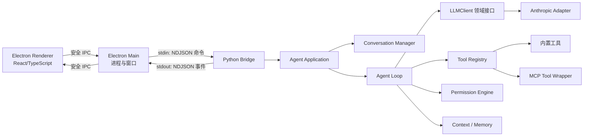

# 霁雪总体架构

## 1. 核心目标

霁雪不是“把 SDK 调通后不断加判断”的脚本，而是一个小型、可替换、可观察的 Agent Harness。首版只支持 Anthropic 协议适配器，但上层只认识霁雪自己的消息、事件、工具和配置类型。

最重要的四条边界：

1. Renderer 不接触 API Key，也不直接启动 Python。
2. Electron Main 只负责窗口、进程生命周期和安全 IPC，不理解 Agent 业务。
3. Python 领域层不导入 Electron、Anthropic 或 MCP SDK。
4. 所有长任务都输出事件流，UI 不同步等待最终结果。

## 2. 进程与数据流



选择 NDJSON 标准输入输出桥接，而不是第一周引入本地 HTTP 服务，原因是依赖更少、流式事件天然适配、端口管理更简单。Python 的标准输出只能写协议事件，普通日志一律写标准错误。

## 3. 目录规划

目录按能力增长，不在第一天创建全部空文件：

```text
myAgent/
├─ apps/
│  └─ desktop/                 # Electron 客户端
│     └─ src/
│        ├─ main/              # 窗口、Python 子进程、IPC
│        ├─ preload/           # contextBridge 白名单
│        └─ renderer/          # 对话 UI
├─ src/jixue/
│  ├─ domain/                  # 消息、事件、配置等纯领域类型
│  ├─ llm/                     # LLM 接口与 Anthropic 适配器
│  ├─ conversation/            # 对话历史与 API 格式转换
│  ├─ tools/                   # 工具、注册中心、执行器
│  ├─ agent/                   # Agent Loop、状态机、取消
│  ├─ prompt/                  # System Prompt 与上下文组装
│  ├─ permissions/             # 五层权限防御
│  ├─ mcp/                     # MCP transport、连接与包装器
│  ├─ context/                 # 大结果卸载与压缩
│  ├─ memory/                  # 会话、项目指令、自动记忆
│  ├─ subagents/               # 第九章的受控子 Agent
│  └─ bridge/                  # Electron 与 Python 的 NDJSON 协议
├─ tests/                      # Python 自动化测试
├─ docs/                       # 设计、教学、日志、手测记录
├─ config/                     # 可提交的示例配置，不含密钥
├─ pyproject.toml
└─ README.md
```

## 4. LLM 边界

### 4.1 四字段配置

单个 `LLMConfig` 严格只有：

```yaml
protocol: anthropic
model: deepseek-v4-flash
base_url: https://api.deepseek.com/anthropic
api_key: ${DEEPSEEK_API_KEY}
```

模型选择器是应用层的“模型目录”，目录中的每个条目仍然生成一个四字段配置。上下文窗口、展示名称、是否实验模型属于模型目录元数据，不进入 `LLMConfig`。

首版模型目录：

| UI 名称 | API 模型名 | 首版用途 |
| --- | --- | --- |
| Flash | `deepseek-v4-flash` | 默认，日常对话和工具任务 |
| Pro | `deepseek-v4-pro` | 复杂任务 |
| Vision Exp | `deepseek-v4-flash-vision-exp` | 先允许选择；图片输入在后续版本开放 |

`protocol` 首版只接受 `anthropic`。遇到其他值要返回“尚未安装该协议适配器”的领域错误，不能悄悄走错协议。

### 4.2 自有接口

领域接口只暴露：

```text
LLMClient.stream(ChatRequest) -> AsyncIterator[LLMEvent]
LLMClient.complete(ChatRequest) -> LLMResponse
```

`anthropic.AsyncAnthropic`、SDK 内容块和 SDK 异常只能出现在 `llm/anthropic_client.py` 与流解析器中。SDK 事件必须先转换成霁雪事件再离开适配器。

## 5. 消息模型

消息分两层：

- API 层：`role + content`，只含供应商能够接受的干净内容块。
- 内部层：增加 `id`、`status`、`created_at`、`usage`、`metadata`。

`ConversationManager.to_api_format()` 按固定顺序处理：

1. 过滤草稿、取消、仅 UI 可见和无有效内容的消息。
2. 把内部内容块转换为协议无关的 API 内容块。
3. 合并相邻同角色消息。
4. 校验 user/assistant 交替关系。
5. 第二章起校验 `tool_use` 与 `tool_result` 的引用关系。
6. 返回新对象，绝不原地修改内部历史。

## 6. 桥接事件协议

每条命令或事件占一行 JSON：

```json
{
  "version": 1,
  "type": "stream_text",
  "request_id": "req_xxx",
  "sequence": 12,
  "timestamp": "2026-08-30T12:00:00Z",
  "payload": {}
}
```

`request_id + sequence` 用于隔离并排序并发请求；未知事件由 UI 忽略并记警告，避免协议升级导致整个客户端崩溃。首批命令为 `chat.send`、`chat.cancel`、`mode.set`、`session.load`，首批事件跟随各章逐步增加。

## 7. UI 原则

- 流式阶段只把文本增量追加到纯文本缓冲区，不对半截 Markdown 反复解析。
- 回复完成后再执行 Markdown 渲染，并做 HTML 清洗。
- 状态栏显示模型、当轮输入/输出 Token、累计 Token、首 Token 耗时和总耗时。
- 工具调用、权限确认、压缩和子 Agent 都用事件卡片展示，不把内部日志混进对话正文。
- Renderer 开启上下文隔离，不暴露 Node 全局对象；API Key 只存在 Python 进程环境中。

## 8. 首版明确不做

- 不做安装包、自动更新和应用商店发布。
- 不实现第二种 LLM SDK，只保留适配器扩展点。
- 不实现图片消息，即使模型目录包含实验视觉模型。
- 不做容器级或虚拟机级系统隔离；第五章提供的是应用层防御，文档必须明确它不是强安全沙箱。
- 不做分布式任务、远程子 Agent、嵌套子 Agent和 Git worktree 隔离。
